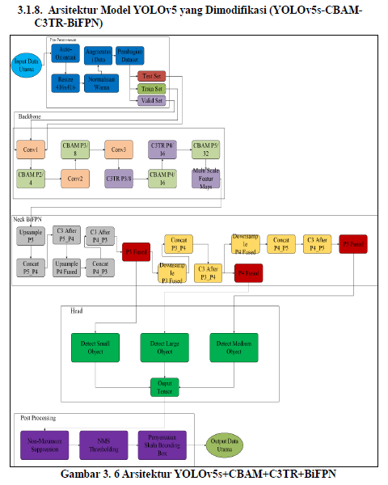
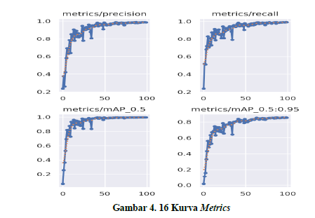
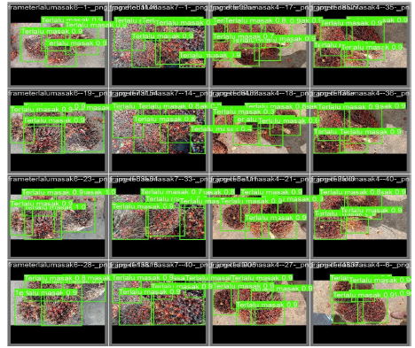
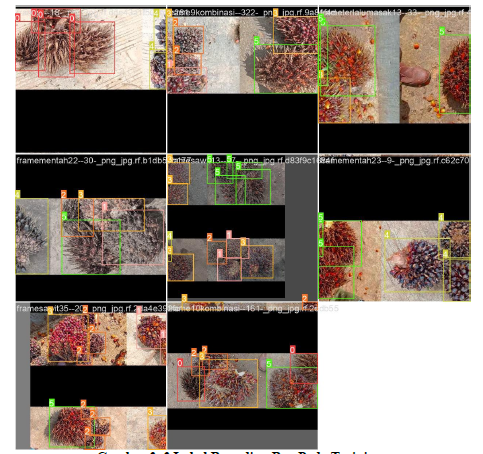
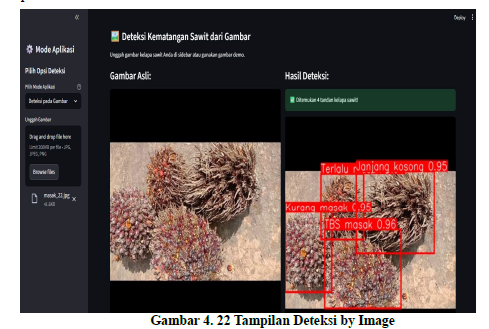
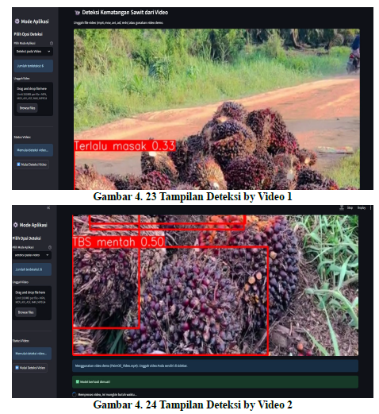
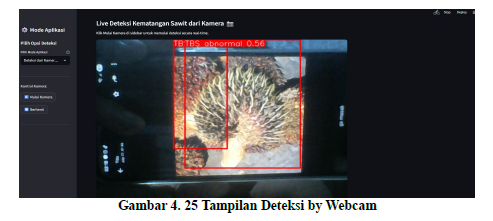

# Palm Oil Fruit Ripeness Detection using CNN

Deteksi tingkat kematangan buah kelapa sawit
menggunakan YOLOv5s yang dikombinasikan
dengan Convolutional Block Attention Module (CBAM),
Transformer Refinement (TR),
dan Bidirectional Feature Pyramid Network (BiFPN).

Sistem ini dirancang untuk melakukan
deteksi objek secara real-time
dan mengklasifikasikan tingkat kematangan buah kelapa sawit
berdasarkan citra digital.

---

## Background

Penentuan tingkat kematangan buah kelapa sawit
secara manual sangat bergantung pada pengalaman manusia
dan berpotensi menimbulkan ketidakkonsistenan penilaian.

Dengan memanfaatkan teknologi **computer vision**
dan **deep learning**, proses deteksi kematangan
dapat dilakukan secara otomatis,
akurat, dan efisien untuk mendukung
sektor perkebunan kelapa sawit.

---

## Research Objectives

Tujuan dari penelitian dan pengembangan sistem ini adalah:
- Mendeteksi objek buah kelapa sawit pada citra digital
- Mengklasifikasikan tingkat kematangan buah kelapa sawit
  ke dalam beberapa kelas kematangan
- Mengembangkan model deteksi objek berbasis YOLOv5s
  dengan integrasi CBAM, BiFPN, dan Transformer Refinement (TR)
- Meningkatkan akurasi dan kualitas ekstraksi fitur
  melalui mekanisme atensi dan penggabungan fitur multi-skala
- Menghasilkan sistem deteksi berbasis deep learning
  yang mampu bekerja secara real-time
  untuk mendukung proses monitoring dan evaluasi panen

---

## Dataset Description

Dataset yang digunakan berupa citra buah kelapa sawit
yang telah dianotasi dalam format **YOLO**.

Kelas kematangan buah yang digunakan:
### Fruit Ripeness Classes

- **Unripe** – Buah mentah
- **Underipe** – Kurang matang
- **Ripe** – Matang
- **Overripe** – Terlalu matang
- **Empty Bunch** – Jajang kosong
- **Abnormal** – Buah abnormal / cacat

Dataset dibagi ke dalam:
- Data latih (training)
- Data validasi (validation)
- Data uji (testing)

---

## Methodology

Penelitian ini mengusulkan pengembangan model deteksi objek
berbasis YOLOv5s dengan mengintegrasikan
Convolutional Block Attention Module (CBAM),
Transformer Refinement (TR),
dan Bidirectional Feature Pyramid Network (BiFPN).

CBAM digunakan untuk meningkatkan kualitas ekstraksi fitur
melalui mekanisme atensi kanal dan spasial,
sehingga model mampu memfokuskan perhatian
pada area citra yang relevan.

BiFPN diterapkan pada bagian neck
untuk mengoptimalkan penggabungan fitur multi-skala
secara dua arah (top-down dan bottom-up),
yang memungkinkan aliran informasi fitur
menjadi lebih efektif.

Transformer Refinement (TR) digunakan
untuk menangkap hubungan global antar fitur
dan memperbaiki representasi fitur tingkat lanjut,
khususnya pada objek dengan variasi ukuran
dan tingkat kematangan yang beragam.

Kombinasi YOLOv5s, CBAM, TR, dan BiFPN
diharapkan mampu meningkatkan akurasi deteksi
tingkat kematangan buah kelapa sawit
dengan tetap mempertahankan efisiensi komputasi.

Metode yang digunakan dalam penelitian ini meliputi:
1. Pengumpulan dan seleksi citra buah kelapa sawit
2. Pembagian dataset (train, validation, test)
3. Pelatihan model menggunakan **YOLOv5**
4. Evaluasi performa model
5. Visualisasi hasil deteksi

---

## Model Architecture

Model deteksi objek yang digunakan adalah **YOLOv5**,
yang terdiri dari tiga komponen utama:
- **Backbone**: Ekstraksi fitur
- **Neck**: Penggabungan fitur multi-skala
- **Head**: Prediksi bounding box dan kelas objek

CBAM diintegrasikan pada bagian backbone
untuk meningkatkan kualitas ekstraksi fitur,
sedangkan Transformer Refinement (TR)
diterapkan pada bagian neck
sebelum proses prediksi objek.

YOLOv5s Standart :
Input → Backbone → Neck (FPN + PAN) → Head

YOLOv5s + CBAM + TR + BiFPN:
Input
→ Backbone + CBAM
→ Neck (BiFPN + Transformer Refinement)
→ Head (Deteksi Objek)

---

## Evaluation Metrics

Performa model dievaluasi menggunakan metrik berikut:
- Precision
- Recall
- mAP@0.5
- mAP@0.5:0.95

Metrik tersebut digunakan untuk mengukur
akurasi deteksi dan klasifikasi tingkat kematangan buah.

---

## Results and Discussion

Hasil pengujian menunjukkan bahwa
model YOLOv5 mampu mendeteksi
dan mengklasifikasikan tingkat kematangan
buah kelapa sawit dengan baik.

Model memberikan hasil deteksi yang stabil
pada berbagai kondisi citra,
serta menunjukkan potensi penerapan
dalam sistem monitoring perkebunan.

---

## Application Preview

### Berikut contoh hasil deteksi tingkat kematangan
buah kelapa sawit menggunakan YOLOv5:

---

### Berikut adalah contoh penerapan aplikasi berbasis python anconda:

---

## Novelty Research

Mengembangkan sistem deteksi objek
tingkat kematangan buah kelapa sawit
menggunakan YOLOv5s berbasis CBAM,
BiFPN, dan Transformer Refinement.

---
