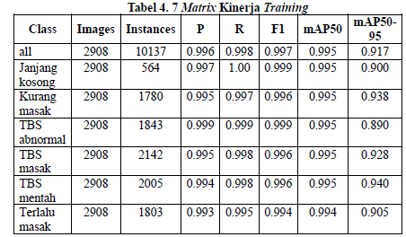
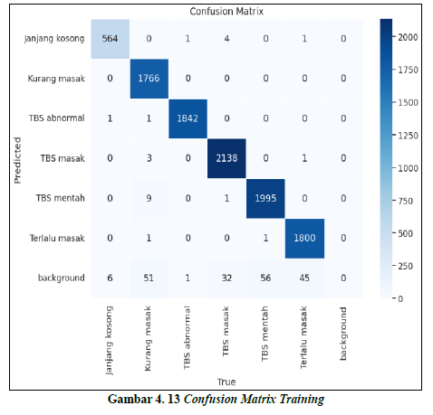
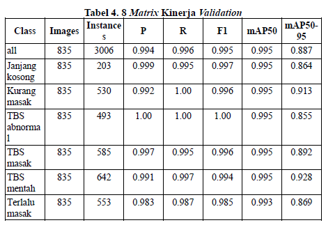
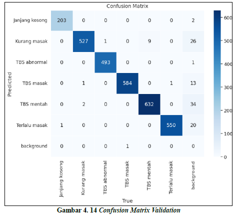
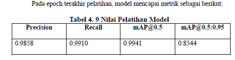
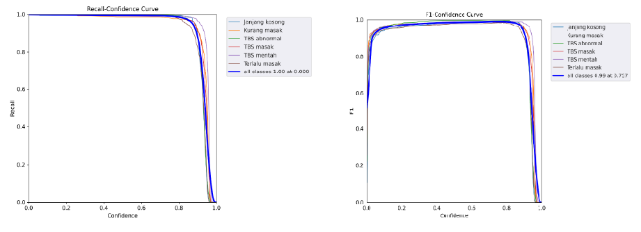

# Palm Oil Fruit Ripeness Detection using CNN

Penelitian ini berfokus pada deteksi tingkat kematangan
buah kelapa sawit menggunakan **YOLOv5s**
yang dikombinasikan dengan
**Convolutional Block Attention Module (CBAM)**,
**Transformer Refinement (TR)**,
dan **Bidirectional Feature Pyramid Network (BiFPN)**.

Sistem dirancang untuk melakukan deteksi objek
secara **real-time**
serta mengklasifikasikan tingkat kematangan
buah kelapa sawit berdasarkan citra digital.

---

## Background

Penentuan tingkat kematangan buah kelapa sawit
secara manual sangat bergantung pada pengalaman manusia
dan berpotensi menimbulkan ketidakkonsistenan penilaian.

Dengan memanfaatkan teknologi **computer vision**
dan **deep learning**,
proses deteksi kematangan buah kelapa sawit
dapat dilakukan secara otomatis,
akurat, dan efisien
guna mendukung produktivitas sektor perkebunan.

---

## Research Objectives

Tujuan dari penelitian dan pengembangan sistem ini adalah:
- Mendeteksi objek buah kelapa sawit pada citra digital
- Mengklasifikasikan tingkat kematangan buah kelapa sawit
  ke dalam beberapa kelas kematangan
- Mengembangkan model deteksi objek berbasis **YOLOv5s**
  dengan integrasi **CBAM, BiFPN, dan Transformer Refinement (TR)**
- Meningkatkan akurasi dan kualitas ekstraksi fitur
  melalui mekanisme atensi dan penggabungan fitur multi-skala
- Menghasilkan sistem deteksi berbasis deep learning
  yang mampu berjalan secara **real-time**
  untuk mendukung proses monitoring dan evaluasi panen

---

## Dataset Description

Dataset yang digunakan berupa citra buah kelapa sawit
yang telah dianotasi dalam format **YOLO**.

### Fruit Ripeness Classes
- **Unripe** – Buah mentah
- **Underripe** – Kurang matang
- **Ripe** – Matang
- **Overripe** – Terlalu matang
- **Empty Bunch** – Janjang kosong
- **Abnormal** – Buah abnormal / cacat

---

### Dataset Split

#### Data Latih (Training)

  
  

#### Data Validasi (Validation)

  
  

#### Data Uji (Testing)

  
  

---

## Methodology

Penelitian ini mengusulkan pengembangan model deteksi objek
berbasis **YOLOv5s**
dengan mengintegrasikan
**CBAM**, **BiFPN**, dan **Transformer Refinement (TR)**.

CBAM digunakan untuk meningkatkan kualitas ekstraksi fitur
melalui mekanisme atensi kanal dan spasial,
sehingga model mampu memfokuskan perhatian
pada area citra yang relevan.

BiFPN diterapkan pada bagian *neck*
untuk mengoptimalkan penggabungan fitur multi-skala
secara dua arah (*top-down* dan *bottom-up*),
sehingga aliran informasi fitur menjadi lebih efektif.

Transformer Refinement (TR) digunakan
untuk menangkap hubungan global antar fitur
dan memperbaiki representasi fitur tingkat lanjut,
khususnya pada objek dengan variasi ukuran
dan tingkat kematangan yang beragam.

---

## Model Architecture

Model deteksi objek yang digunakan adalah **YOLOv5s**
yang terdiri dari tiga komponen utama:
- **Backbone** – Ekstraksi fitur
- **Neck** – Penggabungan fitur multi-skala
- **Head** – Prediksi bounding box dan kelas objek

  

**YOLOv5s Standar:**
Input → Backbone → Neck (FPN + PAN) → Head

**YOLOv5s + CBAM + TR + BiFPN:**
Input
→ Backbone + CBAM
→ Neck (BiFPN + Transformer Refinement)
→ Head (Deteksi Objek)

---

## Evaluation Metrics

Performa model dievaluasi menggunakan metrik:
- Precision
- Recall
- mAP@0.5
- mAP@0.5:0.95

  

---

## Results and Discussion

Hasil pengujian menunjukkan bahwa
model YOLOv5s yang diusulkan
mampu mendeteksi dan mengklasifikasikan
tingkat kematangan buah kelapa sawit
dengan baik.

Integrasi CBAM, BiFPN, dan Transformer Refinement
membantu meningkatkan kualitas ekstraksi fitur
serta kestabilan deteksi
pada berbagai kondisi citra.

---

## Application Preview

### Contoh hasil deteksi tingkat kematangan buah kelapa sawit

  
  

### Contoh penerapan aplikasi berbasis Python (Anaconda)

  
  
  

---

## Research Novelty

Penelitian ini mengusulkan **model deteksi tingkat kematangan buah kelapa sawit**
dengan mengintegrasikan **YOLOv5s, CBAM, BiFPN, dan Transformer Refinement**,
yang memungkinkan peningkatan akurasi deteksi
melalui mekanisme atensi dan penggabungan fitur multi-skala
tanpa mengorbankan efisiensi komputasi real-time.

